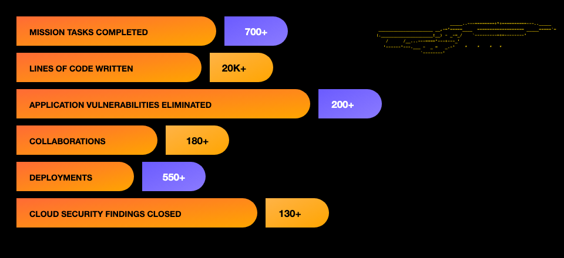

```
 ███████╗████████╗ █████╗ ██████╗ ███████╗██╗     ███████╗███████╗████████╗
 ██╔════╝╚══██╔══╝██╔══██╗██╔══██╗██╔════╝██║     ██╔════╝██╔════╝╚══██╔══╝
 ███████╗   ██║   ███████║██████╔╝█████╗  ██║     █████╗  █████╗     ██║
 ╚════██║   ██║   ██╔══██║██╔══██╗██╔══╝  ██║     ██╔══╝  ██╔══╝     ██║
 ███████║   ██║   ██║  ██║██║  ██║██║     ███████╗███████╗███████╗   ██║
 ╚══════╝   ╚═╝   ╚═╝  ╚═╝╚═╝  ╚═╝╚═╝     ╚══════╝╚══════╝╚══════╝   ╚═╝
```

> *"I remediate production exposures. I research adversary behavior. I hunt for threats in security telemetry. I secure AI-integrated systems."*

---


I am a security-focused engineer who remediates vulnerabilities and hardens production systems across cloud workloads, web applications, and **AI-integrated platforms**. Outside of that work, I build security labs and playgrounds to sharpen my **security research**, **threat hunting**, and hands-on defensive skills.

In my role, I triage security findings across cloud and web environments based on exposure and severity, deliver patches and control improvements, and verify that issues remain remediated. I apply my fullstack and cloud engineering experience to make sure security fixes are implemented safely and work as expected in production.

Alongside this work, I document what I learn through end-to-end security research and ATT&CK-aligned hunt hypotheses. My next area of focus is threat modeling for LLM-integrated applications.

---


<details open>
<summary><b>OPERATIONAL REMEDIATION</b></summary>

I close high-priority security findings in production environments through vulnerability and misconfiguration remediation, runtime and CVE upgrades, exposure reduction, and edge or identity control improvements.

**Status:** ACTIVE DUTY

</details>

<details open>
<summary><b>HUNT DECK</b></summary>

MITRE ATT&CK hypothesis and research notebook. I browse the enterprise technique catalog and attach hunt notes covering hypothesis, sources, telemetry, example queries, false positives, remediation options, and open questions.

**Division:** Science · Tactical  
**Built with:** React, TypeScript, Vite, ATT&CK STIX  
**Status:** UNDERWAY

📁 [`hunt-deck`](https://github.com/kb-bell/hunt-deck)

</details>

<details open>
<summary><b>SENSOR ARRAY — PRACTICE SIEM</b></summary>

I load log files from [`security-log-feeds`](https://github.com/kb-bell/security-log-feeds), write a query, and see which events match.

Queries are KQL-style or Sigma-style. The lab implements a subset of each language, not a full Sentinel or Sigma engine.

I keep operations on separate stations:

- **Hunting** — activity logs (what happened on a host or in an app)
- **Intel** — CISA KEV and similar feeds (what to prioritize)
- **Research** — an experiment and a write-up

Public datasets (OTRF, Microsoft 365 UAL, Loghub slices) are planned as refresh-time downloads. They are not in the repo today, and they will not be copied into source control.

**Division:** Science · Tactical  
**Built with:** React, TypeScript, Vite, Python feed scripts  
**Status:** DRYDOCK — headed for its own repositories

📁 [`sensor-array`](https://github.com/kb-bell/sensor-array) · [`security-log-feeds`](https://github.com/kb-bell/security-log-feeds)

</details>

<details open>
<summary><b>AFTER-ACTION REPORTS</b></summary>

Short, cited write-ups that include the research question, method, evidence, detection or control proposal, and what I would study next. Publishing reproducible write-ups is how I turn reading into practice.

**Division:** Science · Tactical (Cybernetics write-ups to follow)  
**Status:** PENDING ORDERS — first reports reuse Sensor Array and Hunt Deck evidence

</details>

<details>
<summary><b>AI SECURITY SHIELDS</b></summary>

The public teaching version that extends the AI security work I already do on internal AI-integrated platforms. This lab will include scenario cards that cover prompt injection, tool over-reach, sensitive data in model context, insecure RAG, and agent identity failures, each paired with an expected control and a lightweight evaluation check.

Defensive education and hardening only — no training or attacking third-party production models.

**Division:** Cybernetics Lab  
**Status:** AWAITING COMMISSIONING — after the Sensor Array stations are stable

</details>

---


<details>
<summary><b>OPERATIONAL SECURITY · ACTIVE DUTY</b></summary>

Scanner and cloud findings come in, I prioritize by exposure and severity, patch or harden, then verify the issue stays closed.

- Vulnerability and finding triage and remediation
- Cloud hardening across runtime, exposure, and identity
- CVE and end-of-life upgrades, dependency hygiene
- Edge controls and public-surface reduction
- Fullstack delivery when the fix lives in the application

</details>

<details>
<summary><b>SECURITY RESEARCH · SCIENCE DIVISION</b></summary>

```
███████████████░░░░░░ Research question design and scoping
██████████████░░░░░░░ Source discipline (literature, IR reporting, ATT&CK, KEV)
████████████░░░░░░░░░ Reproduction on public or lab telemetry, then a cited write-up
```

A research pass starts with a question, reviews what is already known, tests it against public or lab data, and ends with a write-up where every claim is backed by a citation, a log, or clear steps someone else can follow.

</details>

<details>
<summary><b>THREAT HUNTING · TACTICAL DIVISION</b></summary>

```
████████████████░░░░░ MITRE ATT&CK technique mapping
███████████████░░░░░░ Hypothesis to data source to query
██████████████░░░░░░░ Detection-oriented notes (Sigma- and KQL-style)
```

A hunt starts with a hypothesis, picks the telemetry that could answer it, runs a query, reviews the false positives honestly, and ends in a detection or remediation proposal.

</details>

<details>
<summary><b>AI SECURITY ENGINEERING · CYBERNETICS LAB</b></summary>

```
███████████████░░░░░░ Prompt and model-context exposure on AI APIs
█████████████░░░░░░░░ Auth and network controls on AI service endpoints
███████████░░░░░░░░░░ Threat modeling LLM apps (data, tools, identity, egress)
```

When an AI API is giving away system prompts or other model context, I treat it like any other exposure: confirm what leaked, lock the endpoint down, and verify the catalog is no longer public. Broader injection and agent-abuse practice lives in AI Security Shields as that lab comes online.

</details>

<details>
<summary><b>LANGUAGES AND STACK</b></summary>

**Languages:** JavaScript, TypeScript, Python, SQL, HTML/CSS  
**Application and cloud:** React, Node.js, AWS, Git, Docker  
**Security practice:** MITRE ATT&CK, telemetry and intelligence fixtures, Sigma- and KQL-style query drafts

</details>

---




---


**[GitHub](https://github.com/kb-bell)** | **[LinkedIn](https://www.linkedin.com/in/kbnc)**

---


*"I remediate with urgency, research with citations, hunt from hypotheses, and harden AI-integrated systems with the same evidentiary standard I apply to detections. I verify findings closed and keep claims evidence-backed."*

---

<p align="center">
  
</p>
